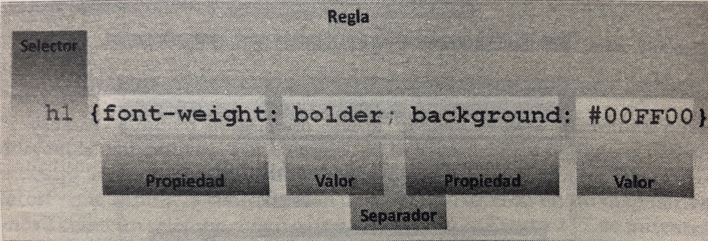

# Conceptos básicos

## Métodos de aplicar estilos CSS: 

En línea: se asigna el estilo dentro de la etiqueta HTML con el atributo `style`. Ej. `
Hola
`.

Embebido: los estilos se definen en la cabecera de la página web con el elemento `` 

Externo: los estilos se definen en un fichero externo y luego se emplea el elemento `<link></link>` para insertar el fichero dentro de cada documento que los necesite. 

- `rel="stylesheet"` indica que se va a incluir una hoja de estilos css. 
- `href="estilos.css"` indica el nombre del archivo. 
- `media="screen"` define un dispositivo en concreto. 

 ## Codificación

@media "UTF-8" especifica que se va a utilizar la codificación de caracteres UTF-8. 

## Especificar valores de los lados

Algunas propiedades tienen diferentes valores de medida, si tiene cuatro valores: superior, derecho, inferior, izquierdo. Si tiene tres valores: superior, derecha e izquierda, inferior. Si tiene dos valores: superior e inferior, derecha e izquierda. Y si tiene un valor: todos. 

Se pueden especificar los bordes por propiedad o por borde: 

- `border-left` 
- `border-color: blue green white black;` 

## Jerarquía de selectores

La jerarquía de los selectores de CSS van con el siguiente orden: 

1. Estilos de línea `
`. 
2. ID `#nombreId`. 
3. Clases `.nombreClase` y atributos y pseudo clases `:first-child` `:hover`.
4. Elementos `a` `p` `ul` y pseudo elementos `::after` `::before` `::first-letter`.