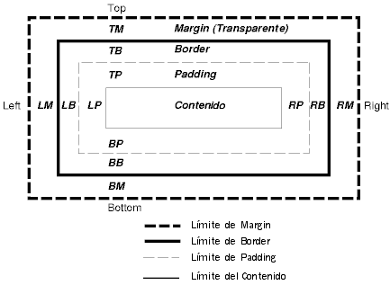
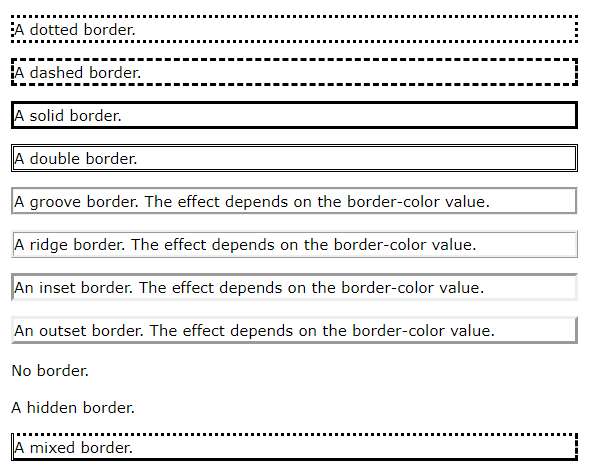

# Modelo caja

## Bordes 

`border:` abreviación de las propiedades siguientes. 

`border-style:` especifica el tipo de borde. 

- `none` ningún borde. 
- `hidden` igual que `none`, excepto en término se resolución de conflictos de bordes para los elemento de tabla. 
- `dotted` el borde es una serie de puntos. 
- `dashed` el borde es una serie de pequeños segmentos de línea. 
- `solid` el borde es un único segmento de línea. 
- `double` el borde son dos línea sólidas. la suma se las dos líneas y el espacio entre ellas es igual al valor de `border-width`. 
- `groove` el borde luce como si estuviese tallado en el lienzo. 
- `ridge` lo opuesto a `groove`. el borde parece que estuviera sobresaliendo del lienzo. 
- `inset` el borde hace que toda la caja luzca como si estuviera empotrada en el lienzo. 
- `outset` lo opuesto a `inset`. el borde hace que toda la caja parezca sobresalir del lienzo.

`border-width:` especifica el ancho de los cuatro bordes. 

- `thin` fino 
- `medium` mediano 
- `thick` grueso

`border-color:` especifica el color del borde. 

`border-radius:` redondea un borde. 

- 4 valores: superior izquierda, superior derecha, inferior derecha, inferior izquierda. 
- 3 valores: superior izquierda, inferior izquierda y superior derecha, inferior derecha. 
- 2 valores: superior izquierda e inferior derecha, superior derecha e inferior izquierda. 
- 1 valor: todos. 

`border-image:` especifica una imagen para ser utilizada en lugar de la frontera normal alrededor de un elemento. Esta propiedad toma una imagen y la parte en 9 pedazos como un gato, toma las esquinas como esquinas del borde y las secciones centrales se repiten o se estiran. 

- url de la imagen 
- Dónde cortar la imagen. 
- Define si las secciones intermedias deber repetirse o se estiran (round, strech). 

## Margen 

`margin:` especifica el ancho del área de margen de una caja, se utiliza para crear elemetnos de espacio alrededor de o fuera de cualquier frontera definida. 

- `auto` el navegador calcula el margen y lo pone en el medio. 
- longitud especifica un margen en px, pt, cm, etc. 
- % especifica un margen en relación de la anchura del elemento que lo contiene. 
- `inherit` especifica que el margen debe ser heredad de elemento padre. 

## Relleno 

`padding:` especifica el ancho del área de relleno de una caja. 

- longitud especifica un relleno en px, pt, cm, etc. 
- % especifica un relleno en relación de la anchura del elemento que lo contiene. 
- `inherit` especifica que el relleno debe ser heredad de elemento padre. 

Cuando usamos `padding` junto con `width` se agrega al ancho especificado del elemento el relleno, para solucionarlo utilizamos `box-sizing: border-box`; 

## Ancho y alto 

Para ajustar el ancho y el alto se utilizan las propiedades `height` y `width`. 

- `auto` el navegador calcula el ancho o alto. 
- longitud especifica en px, pt, cm, etc. 
- % especifica en relación de la anchura del elemento que lo contiene. 
- `inherit` especifica que el alto o ancho debe ser heredad de elemento padre. 
- `initial` establece la altura o anchura a su valor por defecto. 

Para establecer el ancho máximo se utiliza la propiedad `max-width`; tanto en la altura como en la anchura se agregan los tamaños de los demás elementos. 

# Contorno

`outline:` es una línea que se dibuja alrededor de los elementos, fuera de las fronteras para hacer que el elemento destaque, este se dibuja fuera del borde del elemento, y puede superponerse otros contenidos. Además, el esquema no es una parte de las dimensiones del elemento; total de anchura y altura no se ve afectado por el ancho del contenido. 

El contorno tiene las mismas propiedades que `border:`. 