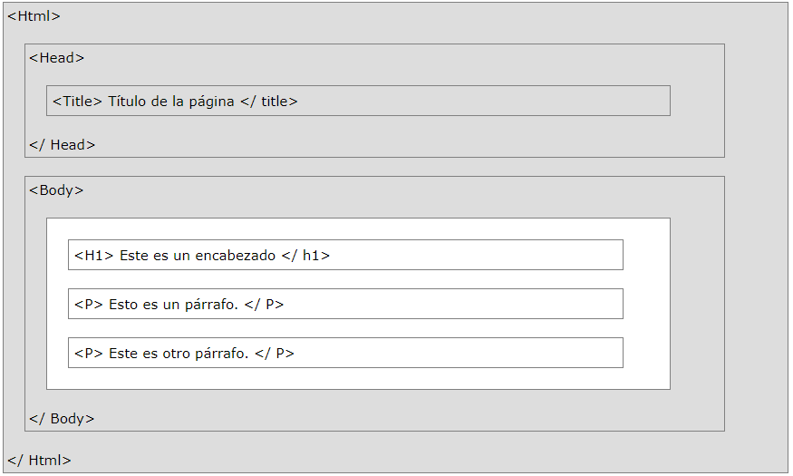

# Estructura de un archivo

~~~html
<!DOCTYPE html>
<html lang="es">
    <head>
        <meta charset="utf-8">
        <title>Plantilla base de HTML5 con la sintaxis de HTML</title>
    </head>
    <body>
        
Contenido a visualizar en la página web.

    </body>
</html>
~~~

`<!DOCTYPE html>` Definición de tipo de documento correspondiente a la versión y la variante de HTML que se utiliza para escribir la página.

`<html></html>` Indica el comienzo y el final de una página, es el elemento raíz. 

 - `lang = "es"` Idioma principal. 

 `<head></head>` Inicio y final de la cabecera (No visualiza en el contenido de la página), contienen los metadatos de la página. 

 `<title></title>` Muestra el titulo (es obligatoria). 

 `<body></body>` Comienzo y final del cuerpo, contenido visible de la página. 

 `<! -- comentario -->` Comentario.

 `<meta/>` Metadatos.

- `charset = "utf-8"` Juego de caracteres.
- `http-equiv="Refresh" content="5"` Refresca la página cada 5 segundos.
- `http-equiv="Refresh" content="5; URL=http://www.google.com"` Redirecciona a la página en 5 segundos.
- `name="propiedad" content="contenido"` Incluir propiedades del documento. 
- `name="robots" content="noindex, nofollow`  para que la página no sea indexada 

