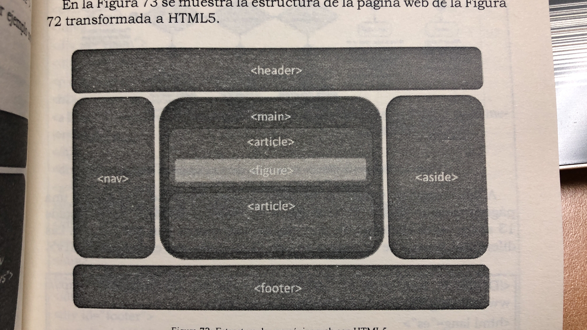

# Estructura de una página

`<header></header>` Cabecera de una página.

`<nav></nav>` Elemento de navegación principal de la página.

`<main></main>` Contenido principal de la página.

`<article></article>` Contenido de la página que puede ser individualizado y utilizado en otra página web.

`<section></section>` Sección del contenido.

`<aside></aside>` Contenido adicional que está relacionado con el contenido principal, pero no es esencial para su comprensión.

`<figure></figure>` Contenedor de una figura, que puede ser una imagen, un fragmento de código, una cita, etc.

`<footer></footer>` Pie de página.

