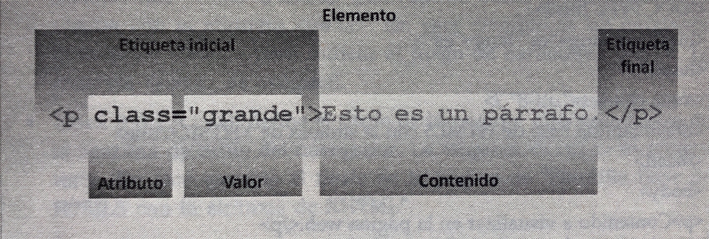

# Etiquetas

`<HTML>` elemento raíz de la página web

`<head>` cabecera de la página web

`<meta>` meta información de la página web

`<title>` título de la página web

`<link>` un enlace independiente del medio

`<style>` información de estilo incluida en la página web

`<script>` código script

`<body>` cuerpo de la página web

`
` un párrafo

`<a>` un enlace o un destino (ancla) para un enlace

`<strong>` énfasis fuerte, mayor que <em>

`<em>` énfasis

`` imagen

`<form>` formulario

`<input>` control de un formulario, por ejemplo, un cuadro de texto o un botón de radio

`<select>` lista de opciones

`<option>` opción de una lista de opciones

`<textarea>` campo de texto multilínea

`<table>` tabla

`<tr>` fila de una table

`<th>` celda de encabezado de una tabla

`<td>` celda de datos de una tabla

`<blockquote>` cita larga

`
` separador horizontal

`<ul>` lista no ordenada

`<ol>` lista ordenada

`<li>` elemento de una lista

`
` contenedor genérico en bloque

