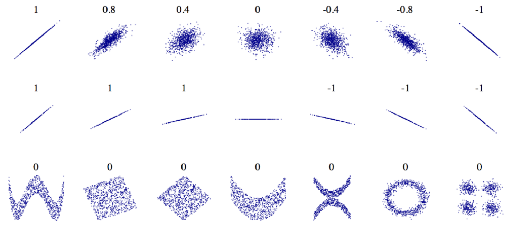

# Crear un proyecto de Machine Learning

Para crear un proyecto de Machine Learning se recomienda seguir los siguientes pasos:

1. Mirar el panorama general
2. Obtener los datos
3. Descubrir y visualizar los datos para obtener información
4. Preparar los datos para el algoritmo de Machin Learning
5. Seleccionar un modelo y capacitarlo
6. Afinar el modelo
7. Presentarlo
8. Iniciar, monitorear y mantener el sistema

## Trabajar con datos reales

Cuando se quiere aprender Machine Learning es preferible trabajar con datos del mundo real y no con datos artificiales, en el Internet existen muchos conjuntos de datos abiertos.

- Repositorios de datos abiertos populares
  - [Depósito de aprendizaje automático UC Irvine](http://archive.ics.uci.edu/ml/index.php)
  - [Conjuntos de datos de Kaggle](https://www.kaggle.com/datasets)
  - [Conjuntos de datos AWS de Amazon](https://registry.opendata.aws/)
- Meta portales (enumeran repositorios de datos abiertos)

  - [Portales de datos](http://dataportals.org/)
  - [OpenDataMonitor](https://opendatamonitor.eu)
  - [Quandl](https://www.quandl.com/)

- Otras páginas que enumeran muchos repositorios de datos abiertos populares

  - [Lista de Wikipedia de conjuntos de datos de Machine Learning](https://homl.info/9)
  - [Quora.com](https://www.quora.com/Where-can-I-find-large-datasets-open-to-the-public)
  - [El subreddit de conjuntos de datos](https://www.reddit.com/r/datasets)

## Mirar la imagen completa

### Enmarcar el problema

Las preguntas para mirar el panorama completo que debe hacer son:

- ¿Cuál es el objetivo comercial del modelo?
- ¿Cómo espera la compañía usar y beneficiarse de este modelo?
- ¿Cómo se ve la solución actual?
- ¿Es supervisado, no supervisado o aprendizaje de refuerzo?
- ¿Es una tarea de clasificación, una tarea de regresión u otra cosa?
- ¿Se debería usar técnicas de aprendizaje por lotes o aprendizaje en línea?

### Seleccionar una medida de rendimiento

Se debe seleccionar una fórmula de medida de rendimiento para ver que tan bueno es el sistema. Entre ellas está:

- Error cuadrático medio (RMSE)
- Error absoluto medio (MAE)

Se pueden ver el archivo [ecuaciones](./Ecuaciones.md).

### Verificar qué se quiere en la salida del modelo

Es importante saber que es lo que se espera en la salida, ya que calcular datos de salida que no son los esperados podría hacernos regresar al principio.

## Obtener los datos

### Descargar los datos

En entornos típicos los datos estarían almacenados en base de datos relacionales o en algún otro almacén de datos común, se deberá ingresar a la base de datos y obtener los datos necesarios.

En algunas ocasiones es necesario realizar funciones especiales para poder obtener los datos y trabajar con ellos.

### Echar un vistazo rápido a la estructura de los datos

Si se trabaja con la librería `pandas` puede utilizar las siguientes funciones para visualizar mejor los datos:

`data.head()` muestra las primeras 5 filas de los datos.

`data.info()` muestra una descripción rápida de los datos.

`data["column"].value_counts()` cuenta cuantos valores hay en cada categoría de la columna.

`data.describe()` obtiene la cantidad de datos, el promedio, la desviación estándar, el valor mínimo, máximo y los 3 percentiles.

`data.hist(bins=50, figsize=(20,15))` `plt.show()` genera un histograma por cada columna.

El vistazo rápido a los datos sirve para detectar cosas en ellos y para entenderlos mejor.

### Crear un conjunto de prueba

Antes de empezar a analizar más los dato hay que hacer un conjunto de pruebas y entrenamiento y dejar el conjunto de pruebas a un lado para después utilizarlo para medir que tan bueno es nuestro sistema.

Se puede generar una función para obtener el conjunto de prueba aleatoria-mente:

~~~python
def split_train_test(data, test_ratio):
  shuffled_indices = np.random.permutation(len(data))
  test_set_size = int(len(data) * test_ratio)
  test_indices = shuffled_indices[:test_set_size]
  train_indices = shuffled_indices[test_set_size:]
  return data.iloc[train_indices], data.iloc[test_indices]

train_set, test_set = split_train_test(housing, 0.2)
~~~

Pero al volver a obtener los conjuntos dado que son aleatorios serán diferentes, por ello podemos crear una función que obtenga los valores siempre aleatorios pero iguales a la última vez y que podamos agregar más datos.

~~~python
def test_set_check(identifier, test_ratio):
  return crc32(np.int64(identifier)) & 0xffffffff < test_ratio * 2 ** 32

def split_train_test_by_id(data, test_ratio, id_column):
  ids = data[id_column]
  in_test_set = ids.apply(lambda id_:test_set_check(id_, test_ratio))
  return data.loc[~in_test_set], data.loc[in_test_set]

housing_with_id = housing.reset_index()
train_set, test_set = split_train_test_by_id(housing_with_id, 0.2, "index")

print(train_set, test_set)
~~~

`sklearn.model_selection` cuenta con la función `train_test_split()` que divide el conjunto de datos en conjunto de entrenamiento y prueba.

~~~python
from sklearn.model_selection import train_test_split

train_set, test_set = train_test_split(housing, test_size=0.2, random_state=42)
~~~

<mark>Volver después</mark>

Si el conjunto de datos es pequeño al momento de dividirlo puede ocurrir el riesgo de introducir un sesgo de muestreo significativo, para evitarlo se divide el conjunto de datos tomando en cuenta su característica más representativa. Es importante tener un número suficiente de instancias en el conjunto de datos para cada estrato, o bien la estimación. La importancia de un estrato puede estar sesgada. Esto significa que no se debe tener demasiados estratos, y cada estrato debe ser lo suficientemente grande.

La funciones `pd.cut()` y `sklearn.model_selection.StratifiedShuffleSplit()` ayudan a esto, por ejemplo:

~~~python
housing["income_cat"] = pd.cut(housing["median_income"], bins=[0., 1.5, 3.0, 4.5, 6., np.inf], labels=[1,2,3,4,5])

#Estas categorías de ingresos se pueden representar
housing["income_cat"].hist()
plt.show()

from sklearn.model_selection import StratifiedShuffleSplit

split = StratifiedShuffleSplit(n_splits=1, test_size=0.2, random_state=42)
for train_index, test_index in split.split(housing, housing["income_cat"]):
    strat_train_set = housing.loc[train_index]
    strat_test_set = housing.loc[test_index]
    
print(strat_test_set["income_cat"].value_counts() / len(strat_test_set))

for set_ in (strat_train_set, strat_test_set):
    set_.drop("income_cat", axis=1, inplace=True)
~~~

## Descubrir y visualizar los datos para obtener información

Ahora se profundizará más en los datos, dejando de lado el conjunto de pruebas, se crea una copio del conjunto de entrenamiento para no dañarlo.

En esta etapa se pueden graficar los datos para entenderlos mejor.

### Buscar correlaciones

Cuando el conjunto de datos no es demasiado grande se puede calcular fácilmente el coeficiente de correlación estándar (también llamado R de Pearson) entre cada par de atributos usando le método `corr()`

~~~python
corr_matrix = housing.corr()
corr_matrix["median_house_value"].sort_values(ascending=False)
~~~

El coeficiente de correlación oscila entre -1 y 1. Cuando está cerca de 1 significa que existe una fuerte correlación positiva, cuando el coeficiente de correlación está cerca de -1 significa que hay una fuerte correlación negativa, finalmente los coeficientes cercanos a 0 significa que no ha correlación lineal.

El coeficiente de correlación sólo mide correlaciones lineales (si X sube, entonces Y generalmente sube/baja).

Otra forma de verificar la correlación entre los atributo es usando el método `scatter_matrix()` que traza cada atributo numérico con cada otro atributo numérico.

~~~python
from pandas.plotting import scatter_matrix

attributes = ["median_house_value", "median_income", "total_rooms", "housing_median_age"]
scatter_matrix(housing[attributes], figsize=(12, 8))
~~~

### Experimentar con combinaciones de atributos

Una última cosa que se puede hacer antes de preparar los datos para los algoritmos de Machine Learning es probar varias combinaciones de atributos. Por ejemplo:

~~~python
housing["rooms_per_household"] = housing["total_rooms"]//housing["households"]
housing["bedrooms_per_room"] = housing["total_bedrooms"]/housing["total_rooms"]
housing["population_per_household"]=housing["population"]/housing["households"]
corr_matrix = housing.corr()
corr_matrix["median_hous_value"].short_values(ascending=False)
~~~

## Preparar los datos para algoritmos de Machine Learning

Para preparar los datos para el algoritmo de Machine Learning  se recomienda hacerlo con funciones en vez de manualmente ya que:

- Esto permite reproducir estas transformaciones fácilmente en cualquier conjunto de datos.
- Se creará gradualmente una biblioteca de funciones de transformación que se podrá reutilizar en futuros proyectos.
- Se puede usar estas funciones en un sistema en vivo para transformar los nuevos datos antes de alimentar el algoritmo.
- Esto permitirá probar fácilmente varias transformaciones y ver qué combinaciones de transformaciones funciona mejor.

Primero se deben limpiar los datos de entrenamiento separando los valores de predicción con las etiquetas.

~~~python
housing = strat_train_set.drop("median_house_value", axis=1)
housing_labels = strat_train_set["median_house_value"].copy()
~~~

### Limpieza de datos

Si uno de los atributos tiene valores faltantes (nulos) hay tres opciones:

1. Deshacerse de los distritos correspondientes.
2. Deshacerse de todo el atributo.
3. Estableces los valores con algún otro valor (cero, media, mediana, etc.).

~~~python
housing.dropna(subset=["total_bedrooms"]) #opción 1
housing.drop("total_bedrooms", axis=1) #opción 2
median = housing["total_bedromms"].median() #opción 3
housing["total_bedrooms"].fillna(median. inplace=True)
~~~

`Scikit-learn` proporciona una clase para cuidar los valores perdidos, primero se necesita crear un instancia de la clase `SimpleImputer` especificando que se desea reemplazar los valores faltantes de cada atributo con la mediana de ese atributo.

~~~python
from sklearn.impute import SimpleImputer

imputer = SimpleImputer(strategy="median")
~~~

Dado que la mediana sólo puede calcular en atributos numéricos, se debe crear una copia con los datos de los atributos no numéricos.

~~~python
housing_num = housing.drop("ocean_proximity", axis=1)
~~~

Ahora se puede ajustar la instancia `imputer` en los datos de entrenamiento con el método `fit()`.

~~~python
imputer.fit(housing_num)
~~~

`imputer` simplemente calcula la mediana de cada atributo y almacena los resultados en su atributo `statistics_`, no se puede estar seguro de que no habrá valores faltantes en los datos nuevos una vez que el sistema se active, por lo que es más seguro aplicar el `imputer` a todos los atributos numéricos.

~~~python
print(imputer.statistics_)
print(housing_num.median().values)
~~~

Ahora se puede usar este "entrenado" `imputer` para transformar el conjunto de entrenamiento reemplazando loa valores faltantes con las medianas aprendidas.

~~~python
X = imputer.transform(housing_num)
housing_tr = pd.DataFrame(X, columns=housing_num.colums, index=housing_num.index)
~~~

### Manejo de texto y atributos categóricos

En en conjunto de datos puede haber texto no arbitrario: hay un número limitado de valores posibles, cada uno de los cuales representa una categoría, entonces ese atributo es un atributo categórico. La mayoría de algoritmos de Machine Learning prefieren trabajar con números, por lo que ha que convertir las categorías de texto a números. Para esto se puede utilizar la clase `sklearn.preprocessing.OrdinalEncoder`.

~~~python
from sklearn.preprocessing import OrdinalEncoder
ordinal_encoder = OrdinalEncoder()
housing_cat_encoded = ordinal_encoder.fit_transform(housing_cat)
print(housing_cat_encoded[:10])
~~~

Se puede obtener la lista de categorías utilizando el atributo `categories_` de la instancia. Es una lista que contiene una matriz de categorías por cada atributo categórico.

~~~python
print(ordinal_encoder.categories_)
~~~

Un problema con esta representación es que los algoritmos de Machine Learning supondrán que dos valores son más similares que dos valores distantes. Esto puede estar bien en algunos casos (por ejemplo, para categorías ordenadas como "malo", "promedio", "bueno", "excelente"). Para solucionar este problema una solución común es crear un atributo binario por categoría, se llama codificación única. `sklearn.preprocessing.OneHotEncoder` proporciona una clase para convertir valores categóricos en vectores únicos.

~~~python
from sklearn.preprocessing import OneHotEncoder
cat_encoder = OneHotEncoder()
housing_cat_1hot = cat_encoder.fit_transform(housing_cat)
print(housing_cat_1hot.toarray())
print(cat_encoder.categories_)
~~~

Si un atributo categórico tiene una gran cantidad de categorías posibles, la codificación de un solo resultado dará como resultado una gran cantidad de características de entrada. Esto puede ralentizar el entrenamiento y degradar el rendimiento. Si esto sucede, es posible que se desee remplazar la entrada categórica con características numéricas útiles relacionadas con las categorías. Alternativamente se puede reemplazar cada categoría con un vector aprendible de baja dimensión llamado incrustación. La representación de cada categoría se aprendería durante el entrenamiento.

### Transformadores personalizados

Aunque Scikit-Learn proporciona muchos transformadores útiles, se deberá escribir los propios para tareas como operaciones de limpieza personalizadas, todo lo que se necesita es hacer es crear una clase e implementar tres métodos `fit()`, `transform()` y `fit_transform()`.

~~~python
from sklearn.base import BaseEstimator, TransformerMixin

rooms_ix, bedrooms_ix, population_ix, households_ix = 3, 4, 5, 6

class CombinedAttributesAdder(BaseEstimator, TransformerMixin):
  def __init__(self, add_bedrooms_per_room = True):
    self.add_bedrooms_per_room = add_bedrooms_per_room
  def fit(self, X, y=None):
    return self
  def transform(self, X):
    rooms_per_household = X[:, rooms_ix] / X[:, households_ix]
    population_per_household = X[:, bedrooms_ix] / X[:, rooms_ix]
    if self.add_bedrooms_per_room:
      bedrooms_per_room = X[:, bedrooms_ix] / X[:, rooms_ix]
      return np.c_[X, rooms_per_household, population_per_household, bedrooms_per_room]
    else:
      return np.c_[X, rooms_per_household, population_per_household]

attr_adder = CombinedAttributesAdder(add_bedrooms_per_room=False)
housing_extra_attribs = attr_adder.transform(housing.values)
~~~

### Escalado de funciones

Una de las transformaciones más importantes que se debe aplicar a los datos es el escalado de características, los algoritmos de Machine Learning no funcionan bien cuando los atributos numéricos de entrada tienen escalas muy diferentes. Hay dos formas de hacer que todos los atributos tengan la misma escala: _normalización_, _estadarización_.

- La normalización es el más simple: los valores se desplazan y reescalan para que terminen en un rango de 0 a 1. Esto se hace restando el valor mínimo y dividiendo por el máximo menos el mínimo. Scikit-Learn proporciona un transformador llamado `MinMaxScaler` para esto.
- La estandarización es diferente: primero se resta el valor medio, y luego se divide por la desviación estandar para que la distribución tenga una varianza unitaria. Sckit-Learn proporciona un transformador llamado `StandarScaler` para la estandarización.

La estandarización no limita los valores a un rango específico, lo que puede ser un problema para algunos algoritmos, por ejemplo las redes neuronales a menudo esperan un valor de entrada que varía de 0 a 1. Sin embargo, la estandarización se ve mucho menos afectada por los valores atípicos.

### Tuberías de transformación

Scikit-Learn proporciona la clase `Pipeline` para ayudar con las secuencias de transformación.

~~~python
from sklearn.pipeline import Pipeline
from sklearn.preprocessing import StandardScaler

num_pipeline = Pipeline([('imputer', SimpleImputer(strategy="median")), ('attribs_adder', CombinedAttributesAdder()), ('std_scaler', StandardScaler())])

housing_num_tr = num_pipeline.fit_transform(housing_num)
~~~

Scikit-Learn introduce `ColumnTransformer` que es un transformador capaz de manejar todas las columnas, aplicando transformaciones apropiadas a cada columna.

~~~python
from sklearn.compose import ColumnTransformer

num_attribs = list(housing_num)
cat_attribs = ["ocean_proximity"]

full_pipeline = ColumnTransformer([("num", num_pipeline, num_attribs), ("cat", OneHotEncoder(), cat_attribs)])
~~~

## Seleccionar y entrenar un modelo

### Entrenamiento y evaluación en el conjunto de entrenamiento

Primero se puede entrenar un modelo de regresión lineal.

~~~python
from sklearn.linear_model import LinearRegression

lin_reg = LinearRegression()
lin_reg.fit(housing_prepared, housing_labels)

some_data = housing.iloc[:5]
some_labels = housing_labels.iloc[:5]
some_data_prepared = full_pipeline.transform(some_data)
print("Predictions: ", lin_reg.predict(some_data_prepared))
print("Labels: ", list(some_labels))
~~~

Con el error cuadrático medio (RMSE) se puede medir el error del modelo.

~~~python
from sklearn.metrics import mean_squared_error
housing_predictions = lin_reg.predict(housing_prepared)
lin_mse = mean_squared_error(housing_labels, housing_predictions)
lin_rmse = np.sqrt(lin_mse)
print(lin_rmse)
~~~

También se puede entrenar un modelo de árbol de desición.

~~~python
from sklearn.tree import DecisionTreeRegressor

tree_reg = DecisionTreeRegressor()
tree_reg.fit(housing_prepared, housing_labels)

housing_predictions = tree_reg.predict(housing_prepared)
tree_mse = mean_squared_error(housing_labels, housing_predictions)
tree_rmse = np.sqrt(tree_mse)
print(tree_rmse)
~~~

### Mejor evaluación usando validación cruzada

Una forma de evaluara el modelo del árbol de decisión y el modelo de regresión es utilizando la función `train_test_split()` para crear con el conjunto de entrenamiento un conjunto de validación.

Una gran alternativa es usar la característica de Scikit-Learn K-fold cross-validation dividiendo el conjunto de entrenamiento en 10 subconjuntos distintos llamados pliegues, luego entrenando y evaluando el modelo de árbol de decisión 10 veces, eligiendo pliegues diferentes para la evaluación cada vez y entrenando en los otros 9 pliegues. El resultado es una matriz que contiene los 10 puntajes de evaluación.

~~~python
from sklearn.model_selection import cross_val_score
scores = cross_val_score(tree_reg, housing_prepared, housing_labels, scoring="neg_mean_squared_error", cv=10)
tree_rmse_scores = np.sqrt(-scores)

def display_scores(scores):
  print("Scores: ", scores)
  print("Mean: ", scores.mean())
  print("Standar deviation: ", scores.std())

print("Decision Tree")
display_scores(tree_rmse_scores)

lin_scores = cross_val_score(lin_reg, housing_prepared, housing_labels, scoring="neg_mean_squared_error", cv=10)
lin_rmse_scores = np.sqrt(-lin_scores)

display_scores(lin_rmse_scores)
~~~

La validación cruzada permite obtener no sólo una estimación del rendimiento del modelo, sino también una medida de la precisión de esta estimación, es decir, su desviación estándar.

El modelo de bosques aleatorios trabaja entrenando muchos árboles de decisión en subconjuntos aleatorios de características, y luego promedia las predicciones.

~~~python
from sklearn.ensemble import RandomForestRegressor
forest_reg = RandomForestRegressor()
forest_reg.fit(housing_prepared, housing_labels)

forest_scores = cross_val_score(forest_reg, housing_prepared, housing_labels, scoring="neg_mean_squared_error", cv=10)
forest_rmse_scores = np.sqrt(-forest_scores)
display_scores(forest_rmse_scores)
~~~

Se debe guardar cada modelo con el que se experimenta para poder regresar fácilmente a cualquier modelo que se desee, esto permitirá comparar fácilmente los puntajes entre los tipos de modelos y comparar los tipos de errores que cometen.

~~~python
import joblib

joblib.dump(my_model, "my_model.pkl")
#cargar el modelo
my_model_loaded = joblib.load("my_model.pkl")
~~~

## Afinar el modelo

<mark>Volver después</mark>

Ahora se tiene una lista de modelos prometedores que se necesitan ajustar.

### Búsqueda de cuadrícula

Una opción sería jugar con los hiperparámetros manualmente hasta que se encuentre una combinación de valores hiperparámetros. Este sería un trabajo tedioso, y es posible que no se tenga el tiempo para explorar muchas combinaciones. En cambio `sklearn.model_selection.GridSearchCV` para buscar los hiperparámetros. Todo lo que se necesita es decirle que hiperparámetros se desea experimentar y qué valores probar, y utilizar la validación cruzadas para evaluar todas las combinaciones posibles de valores de hiperparámetros.

~~~python
from sklearn.model_selection import GridSearchCV

param_grid = [{'n_estimators':[3, 10, 30], 'max_features':[2,4,6,8]}, {'bootstrap':[False], 'n_estimators':[3,10], 'max_features':[2,3,4]}]
forest_reg = RandomForestRegressor()

grid_search = GridSearchCV(forest_reg, param_grid, cv=5, scoring='neg_mean_squared_error', return_train_score=True)

grid_search.fit(housing_prepared, housing_labels)
cvres = grid_search.cv_results_
for mean_score, params in zip(cvres["mean_test_score"], cvres["params"]):
  print(np.sqrt(-mean_score), params)
~~~

Cuando no se tiene idea de qué valores debe tener un hiperparámetro, un enfoque más simple es probar con potencias consecutivas de 10 o un número menor si se desea una búsqueda más detallada.

Al aplicarlo se puede obtener la mejor combinación de parámetros con `grid_search.best_params_`, también se puede obtener el mejor estimador con `grid_search.best_estimator_`.

Si `GridSearchCV` se inicializa con `refit=True`, luego, una vez que encuentra el mejor estimador mediante validación cruzada, lo vuelve a capacitar en todo el conjunto de entrenamiento.

### Búsqueda aleatoria

El enfoque de cuadrícula está bien cuando se explora relativamente pocas combinaciones, pero cuando el espacio de búsqueda de hiperparámetros es grande, a menudo es preferible usar `RandomSearchCV` en lugar. Esta clase se puede usar de la misma manera que `GridSearchCV` pero en lugar de probar todas las combinaciones posibles, evalúa un número dado de combinaciones aleatorias seleccionando un valor aleatorio para cada hiperparámetro en cada iteración. Sus beneficios son:

- Si se deja la búsqueda aleatoria ejecute por ejemplo 1000 iteraciones, esta explorará 1000 valores diferentes.
- Configurando el número de iteraciones se tiene más control sobre el presupuesto de cómputo que desea asignar a la búsqueda de hiperparámetros.

### Métodos de conjunto

Otra forma de ajustar el sistema es intentar combinar los modelos que funcionan mejor. El grupo (o "conjunto") a menudo se desempeñará mejor que el mejor modelo individual especialmente si los modelos individuales cometen tipos de errores muy diferentes.

### Analizar los mejores modelos y sus errores

A menudo se obtendrán buenos conocimientos sobre el problema al inspeccionar los mejores modelos. `RandomForestRegressor` puede indicar la importancia relativa de cada atributo para hace predicciones precisas:

~~~python
feature_importances = grid_search.best_estimator_.feature_importances_
print(feature_importances)
~~~

Se pueden mostrar los puntajes de importancia junto a sus nombre de atributos correspondientes:

~~~python
extra_attribs = ["rooms_per_hhold", "pop_per_hhold", "bedrooms_per_room"]
cat_encoder = full_pipeline.named_transformers_["cat"]
cat_one_hot_attribs = list(cat_encoder.categories[0])
attributes = num_attribs + extra_attribs + cat_one_hot_attribs
print(sorted(zip(feature_importance, attributes), reverse=True))
~~~

Con la información se puede intentar eliminar algunas características menos útiles. También se puede observar los errores específicos que comete el sistema, luego se puede tratar de entender por qué los comete y qué puede solucionar el problema. 

### Evaluar el sistema en el conjunto de prueba

Después de ajustar los modelos por un tiempo, finalmente se tiene un sistema que funciona lo suficientemente bien. Ahora es el momento de evaluar el modelo final en el conjunto de prueba. Para esto se debe obtener las etiquetas del conjunto de prueba, luego transformar los datos `transform()` no `fit_transform()`.

~~~python
final_model = grid_search.best_estimator_

X_test = strat_test_set.drop("median_house_value", axis=1)
y_test = strat_test_set["median_house_value"].copy()

X_test_prepared = full_pipeline.transform(X_test)

final_predictions = final_model.predict(X_test_prepared)

final_mse = mean_squared_error(y_test, final_predictions)
final_rmse = np.sqrt(final_mse)
print(final_rmse)
~~~

En algunos casos, tal estimación puntual del error de generalización no será suficiente para convencer de lanzar el modelo: ¿qué para si es sólo un 0.1% mejor que el modelo actual en producción? Es posible que se desee tener una idea de cuán precisa es esta estimación. Para esto se puede calcular un 95% de intervalo de confianza para el error de generalización usando `scipy.stats.t.interval()`

~~~python
from scipy import stats
confidence = 0.95
squared_errors = (final_predictions - y_test) ** 2
np.sqrt(stats.t.interval(confidence, len(squared_errors) - 1, loc=squared_errors.mean(), scale=stats.sem(squared_errors)))
~~~

Si se realizó una gran cantidad de ajustes de hiperparámetros, el rendimiento generalmente será ligeramente peor de lo que se midió utilizando la validación cruzada (porque el sistema termina ajustando para funcionar bien en los datos de validación y probablemente no funcionará tan bien en conjuntos de datos desconocidos), pero cuando esto sucede se debe resistir la tentación de ajustar los hiperparámetros para que los números se vean bien en el conjunto de prueba.

Antes de lanzar el sistema se debe documentar:

- La solución
- Lo que ha aprendido
- Lo que funcinó
- Lo que no funcionó
- Las suposiciones que se hicieron
- Las limitaciones del sistema

## Inciar, monitorear y mantener el sistema

Ahora se debe guardar el modelo y realizar la documentación del modelo, una vez hecho eso se puede implementar el modelo en el entorno de producción y usarlo con la método `predict()`.

Pero el despliegue del modelo no es el final de la historia, también se debe escribir un código de monitoreo para verificar el rendimiento en vivo del sistema a intervalos regulares y activar alertas cuando se caiga.

Incluso un modelo entrenado para clasificar imágenes de perros y gatos puede necesitar ser reentrenado regularmente, no porque los gatos y los perros muten durante la noche, sino porque las cámaras siguen cambiando, junto con los formatos de imagen, nitidez, brillo y proporciones de tamaño.

Para medir si el sistema se está deteriorando se debe establecer una variable que mida que tan efectivo es el modelo, ya sea mediante una encuesta a los usuarios o dentro del mismo sistema. También se debe definir que hacer en caso de que el sistema fallé lo cuál es un trabajo largo el cual se puede automatizar, algunas de las cosas que se puede automatizar son:

- Recopilar nuevos datos y etiquetarlos.
- Escribir un script para entrenar el modelo y ajustar los hiperparámetros automáticamente.
- Escribir un script para evaluar el modelo nuevo y viejo en el conjunto de pruebas actualizado y desplegar el modelo si el rendimiento no ha disminuido (si lo hizo hay que investigar por qué).
- Evaluar la calidad de los datos de entrada monitoreando si faltan entradas, si la desviación media o estándar se aleja demasiado del conjunto de entrenamiento, o si una categoría empieza a tener nuevos valores.

Finalmente se debe tener una copia de seguridad de cada modelo y de cada conjunto de datos.